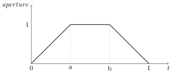

# Nodes

The following sections describe available nodes in technical terms. Refer to \[the rendering guidelines\](guidelines.md#chapter-guidelines) for usage details.

<table style="width:3%;">
<caption>Overview of nsi nodes</caption>
<colgroup>
<col style="width: 2%" />
</colgroup>
<tbody>
<tr class="odd">
<td><blockquote>
<p><strong>Node</strong> | <strong>Function</strong> |</p>
</blockquote>
<dl>
<dt>========================================+==========================+</dt>
<dd>
<p>[root](nodes.md#node-root) | The scene's root |</p>
</dd>
</dl></td>
</tr>
<tr class="even">
<td>[global](nodes.md#node-global) | Global settings node |</td>
</tr>
<tr class="odd">
<td><dl>
<dt>[set](nodes.md#node-set) | Expresses relationships |</dt>
<dd>
<div class="line-block">of groups of nodes |</div>
</dd>
</dl></td>
</tr>
<tr class="even">
<td><dl>
<dt>[shader](nodes.md#node-shader) | [ᴏsʟ](<a href="https://opensource.imageworks.com/?p=osl">https://opensource.imageworks.com/?p=osl</a>) shader or layer in</dt>
<dd>
<div class="line-block">a shader group |</div>
</dd>
</dl></td>
</tr>
<tr class="odd">
<td><dl>
<dt>[attributes](nodes.md#node-attributes) | Container for generic |</dt>
<dd>
<div class="line-block">attributes (e.g. |<br />
visibility) |</div>
</dd>
</dl></td>
</tr>
<tr class="even">
<td><dl>
<dt>[transform](nodes.md#node-transform) | Transformation to place |</dt>
<dd>
<div class="line-block">objects in the scene |</div>
</dd>
</dl></td>
</tr>
<tr class="odd">
<td><dl>
<dt>[instances](nodes.md#node-instances) | Specifies instances of |</dt>
<dd>
<div class="line-block">other nodes |</div>
</dd>
</dl></td>
</tr>
<tr class="even">
<td>[plane](nodes.md#node-plane) | An infinite plane |</td>
</tr>
<tr class="odd">
<td><dl>
<dt>[mesh](nodes.md#node-mesh) | Polygonal mesh or |</dt>
<dd>
<div class="line-block">subdivision surface |</div>
</dd>
</dl></td>
</tr>
<tr class="even">
<td><dl>
<dt>[faceset](nodes.md#node-faceset) | Assign attributes to |</dt>
<dd>
<div class="line-block">part of a mesh, curves |<br />
or paticles. |</div>
</dd>
</dl></td>
</tr>
<tr class="odd">
<td><dl>
<dt>[curves](nodes.md#node-curves) | Linear, b-spline and |</dt>
<dd>
<div class="line-block">Catmull-Rom curves |</div>
</dd>
</dl></td>
</tr>
<tr class="even">
<td>[particles](nodes.md#node-particles) | Collection of particles |</td>
</tr>
<tr class="odd">
<td><dl>
<dt>[procedural](nodes.md#node-procedural) | Geometry to be loaded |</dt>
<dd>
<div class="line-block">or generated in delayed |<br />
fashion |</div>
</dd>
</dl></td>
</tr>
<tr class="even">
<td><dl>
<dt>[volume](nodes.md#node-volume) | A volume loaded from an |</dt>
<dd>
<div class="line-block">[OpenVDB](<a href="https://www.openvdb.org">https://www.openvdb.org</a>) file |</div>
</dd>
</dl></td>
</tr>
<tr class="odd">
<td><dl>
<dt>[environment](nodes.md#node-environment) | Geometry type to define |</dt>
<dd>
<div class="line-block">environment lighting |</div>
</dd>
</dl></td>
</tr>
<tr class="even">
<td><dl>
<dt>[camera](nodes.md#node-camera) | Set of nodes to create |</dt>
<dd>
<div class="line-block">viewing cameras |</div>
</dd>
</dl></td>
</tr>
<tr class="odd">
<td><dl>
<dt>[outputdriver](nodes.md#node-outputdriver) | A target where to |</dt>
<dd>
<div class="line-block">output rendered pixels |</div>
</dd>
</dl></td>
</tr>
<tr class="even">
<td><dl>
<dt>[outputlayer](nodes.md#node-outputlayer) | Describes one render |</dt>
<dd>
<div class="line-block">layer to be connected |<br />
to an <code>outputdriver</code> |<br />
node |</div>
</dd>
</dl></td>
</tr>
<tr class="odd">
<td><dl>
<dt>[screen](nodes.md#node-screen) | Describes how the view |</dt>
<dd>
<div class="line-block">from a camera node will |<br />
be rasterized into an |<br />
<code>outputlayer</code> node |</div>
</dd>
</dl></td>
</tr>
</tbody>
</table>

Overview of nsi nodes

## The Root Node

The root node is much like a transform node. With the particularity that it is the \[end connection\](guidelines.md#section-basicscene) for all renderable scene elements. A node can exist in an nsi context without being connected to the root note but in that case it won\'t affect the render in any way. The root node has the reserved handle name `.root` and doesn't need to be created using \[NSICreate\](c-api.md#capi-nsicreate). The root node has two defined attributes: `objects` and `geometryattributes`. Both are explained under the \[transform node\](nodes.md#node-transform).

## The Global Node

This node contains various global settings for a particular nsi context. Note that these attributes are for the most case implementation specific.

This node has the reserved handle name `.global` and does _not_ need to be created using \[NSICreate\](c-api.md#capi-nsicreate). The following attributes are recognized by _3Delight_:

<table style="width:14%;">
<caption>global node optional attributes</caption>
<colgroup>
<col style="width: 4%" />
<col style="width: 1%" />
<col style="width: 2%" />
<col style="width: 5%" />
</colgroup>
<tbody>
<tr class="odd">
<td rowspan="3"><blockquote>
<p><strong>Name</strong></p>
</blockquote>
<dl>
<dt>=================================</dt>
<dd>
<p><code>numberofthreads</code></p>
<p><code>threads.count</code> (!)</p>
</dd>
</dl></td>
<td rowspan="3"><blockquote>
<p><strong>Type</strong></p>
</blockquote>
<dl>
<dt>==========</dt>
<dd>
<p>integer</p>
</dd>
</dl></td>
<td colspan="2" rowspan="2"><blockquote>
<p><strong>Description/Values</strong></p>
</blockquote>
<dl>
<dt>============================================</dt>
<dd>
<p>Specifies the total number of threads to use for a particular render:</p>
</dd>
</dl></td>
</tr>
<tr class="even">
</tr>
<tr class="odd">
<td colspan="2"><ul>
<li>A value of <code>0</code> lets the render engine choose an optimal thread value. This is is the <strong>default</strong> behaviour.</li>
<li>Any positive value directly sets the total number of render threads.</li>
<li>A negative value will start as many threads as optimal <em>plus</em> the specified value. This allows for an easy way to to decrease the total number of render threads.</li>
</ul></td>
</tr>
<tr class="even">
<td><p><code>renderatlowpriority</code></p>
<p><code>priority.low</code> (!)</p></td>
<td>integer</td>
<td colspan="2">If set to 1, start the render with a lower process priority. This can be useful if there are other applications that must run during rendering.</td>
</tr>
<tr class="odd">
<td><p><code>texturememory</code></p>
<p><code>texture.memory</code> (!)</p></td>
<td>integer</td>
<td colspan="2">Specifies the approximate maximum memory size, in megabytes, the renderer will allocate to accelerate texture access.</td>
</tr>
<tr class="even">
<td rowspan="6"><p><code>bucketorder</code></p>
<p><code>bucket.order</code> (!)</p></td>
<td rowspan="6">string</td>
<td colspan="2">Specifies in what order the buckets are rendered. The available values are:</td>
</tr>
<tr class="odd">
<td><code>horizontal</code></td>
<td>Row by row, left to right and top to bottom. This is the <strong>default</strong>.</td>
</tr>
<tr class="even">
<td><code>vertical</code></td>
<td>Column by column, top to bottom and left to right.</td>
</tr>
<tr class="odd">
<td><code>zigzag</code></td>
<td>Row by row, left to right on even rows and right to left on odd rows.</td>
</tr>
<tr class="even">
<td><code>spiral</code></td>
<td>In a clockwise spiral from the centre of the image.</td>
</tr>
<tr class="odd">
<td><code>circle</code></td>
<td>In concentric circles from the centre of the image.</td>
</tr>
<tr class="even">
<td><code>frame</code></td>
<td>integer</td>
<td colspan="2">Provides a frame number to be used as a | seed for the sampling pattern. | See the [screen node](nodes.md#node-screen).</td>
</tr>
<tr class="odd">
<td><code>lightcache</code></td>
<td>integer (1)</td>
<td colspan="2"><p>Controls use of the renderer's light cache. Set this to <span class="title-ref">0</span> to switch the cache off.</p>
<p>When this is switched on, each bucket is visited twice during rendering.</p>
<p><strong>WARNING:</strong> <em>display drivers that do not request scanline order need to make sure they handle this gracefully.</em></p></td>
</tr>
</tbody>
</table>

global node optional attributes

|                          |         |                                                                                                                                                                                                                                                                                             |
| ------------------------ | ------- | ------------------------------------------------------------------------------------------------------------------------------------------------------------------------------------------------------------------------------------------------------------------------------------------- |
| `networkcache.size`      | integer | Specifies the maximum network cache size, in gigabytes (_GB_, not _GiB_), the renderer will use to cache textures on a local drive to accelerate data access.                                                                                                                               |
| `networkcache.directory` | string  | Specifies the directory in which textures will be cached. A good default value is `/var/tmp/3DelightCache` on Linux systems.                                                                                                                                                                |
| `networkcache.write`     | integer | Enables caching for image write operations. This alleviates pressure on networks by first rendering images to a local temporary location and copying them to their final destination at the end of the render. This replaces many small network writes by more efficient larger operations. |

global node optional network cache attributes

|                  |         |                                                                                                                                                                                                                                                                                                                        |
| ---------------- | ------- | ---------------------------------------------------------------------------------------------------------------------------------------------------------------------------------------------------------------------------------------------------------------------------------------------------------------------- |
| `license.server` | string  | Specifies the name or IP address of the license server to be used.                                                                                                                                                                                                                                                     |
| `license.wait`   | integer | When no license is available for rendering, the renderer will wait until a license is available if this attribute is set to `1`, but will stop immediately if it is set to `0`. The latter setting is useful when managing a renderfarm and other work could be scheduled instead.                                     |
| `license.hold`   | integer | By default, the renderer will get new licenses for every render and release them once it is done. This can be undesirable if several frames are rendered in sequence from the same process process. If this option is set to `1`, the licenses obtained for the first frame are held until the last frame is finished. |

global node optional attributes for licensing

<table style="width:14%;">
<caption>global node optional attributes governing ray tracing quality</caption>
<colgroup>
<col style="width: 4%" />
<col style="width: 1%" />
<col style="width: 8%" />
</colgroup>
<tbody>
<tr class="odd">
<td><p><code>maximumraydepth.diffuse</code></p>
<p><code>diffuse.ray.depth.max</code> (!)</p></td>
<td>integer</td>
<td>Specifies the maximum bounce depth a ray | emitted from a diffuse [closure](<a href="https://www.3delight.com/documentation/display/3DSP/3Delight&#39;s+OSL+Support">https://www.3delight.com/documentation/display/3DSP/3Delight's+OSL+Support</a>) can reach. A depth of <code>1</code> specifies one | additional bounce compared to purely local | illumination. |</td>
</tr>
<tr class="even">
<td><p><code>maximumraylength.diffuse</code></p>
<p><code>diffuse.ray.length.max</code> (!)</p></td>
<td>double</td>
<td>Limits the distance a ray emitted from a | diffuse [closure](<a href="https://www.3delight.com/documentation/display/3DSP/3Delight&#39;s+OSL+Support">https://www.3delight.com/documentation/display/3DSP/3Delight's+OSL+Support</a>) can travel. | Using a relatively low value for this | attribute might improve performance | without significantly affecting the look | of the resulting image, as it restrains | the extent of global illumination. | | Setting this to a negative value disables | the limitation. |</td>
</tr>
<tr class="odd">
<td><p><code>maximumraydepth.reflection</code></p>
<p><code>reflection.ray.depth.max</code> (!)</p></td>
<td>integer</td>
<td>Specifies the maximum bounce depth a | reflection/glossy/specular ray can reach. | | | Setting reflection depth to 0 will only | compute local illumination resulting in | only surfaces with an emission [closure](<a href="https://www.3delight.com/documentation/display/3DSP/3Delight&#39;s+OSL+Support">https://www.3delight.com/documentation/display/3DSP/3Delight's+OSL+Support</a>) to appear in reflections. |</td>
</tr>
<tr class="even">
<td><p><code>maximumraylength.reflection</code></p>
<p><code>reflection.ray.length.max</code> (!)</p></td>
<td>double</td>
<td>Limits the distance a reflection/glossy/specular ray can travel. Setting this to a negative value disables the limitation.</td>
</tr>
<tr class="odd">
<td><p><code>maximumraydepth.refraction</code></p>
<p><code>refraction.ray.depth.max</code> (!)</p></td>
<td>integer</td>
<td><p>Specifies the maximum bounce depth a refraction ray can reach.</p>
<p>The default value of <code>4</code> allows light to shine through a properly modeled object such as a glass.</p></td>
</tr>
<tr class="even">
<td><p><code>maximumraylength.refraction</code></p>
<p><code>refraction.ray.length.max</code> (!)</p></td>
<td>double</td>
<td>Limits the distance a refraction ray can travel. Setting this to a negative value disables the limitation.</td>
</tr>
<tr class="odd">
<td><p><code>maximumraydepth.hair</code></p>
<p><code>hair.ray.depth.max</code> (!)</p></td>
<td>integer</td>
<td><p>Specifies the maximum bounce depth a hair ray can reach.</p>
<p>Note that hair are akin to volumetric primitives and might need elevated ray depth to properly capture the illumination.</p></td>
</tr>
<tr class="even">
<td><p><code>maximumraylength.hair</code></p>
<p><code>hair.ray.length.max</code> (!)</p></td>
<td>double</td>
<td>Limits the distance a hair ray can travel. Setting this to a negative value disables the limitation.</td>
</tr>
<tr class="odd">
<td><p><code>maximumraydepth.volume</code></p>
<p><code>volume.ray.depth.max</code> (!)</p></td>
<td>integer</td>
<td>Specifies the maximum bounce depth a volume ray can reach.</td>
</tr>
<tr class="even">
<td><p><code>maximumraylength.volume</code></p>
<p><code>volume.ray.length.max</code> (!)</p></td>
<td>double</td>
<td>Limits the distance a volume ray can travel. Setting this to a negative value disables the limitation.</td>
</tr>
</tbody>
</table>

global node optional attributes governing ray tracing quality

<table style="width:14%;">
<caption>global node optional attributes controlling overall image quality</caption>
<colgroup>
<col style="width: 4%" />
<col style="width: 1%" />
<col style="width: 8%" />
</colgroup>
<tbody>
<tr class="odd">
<td><p><code>quality.shadingsamples</code></p>
<p><code>shading.samples</code> (!)</p></td>
<td>integer</td>
<td>Controls the quality of BSDF sampling. Larger values give less visible noise.</td>
</tr>
<tr class="even">
<td><p><code>quality.volumesamples</code></p>
<p><code>volume.samples</code> (!)</p></td>
<td>integer</td>
<td>Controls the quality of volume sampling. Larger values give less visible noise.</td>
</tr>
<tr class="odd">
<td><p><code>show.displacement</code></p>
<p><code>shading.displacement</code> (!)</p></td>
<td>integer</td>
<td>When set to <code>1</code>, enables displacement shading. Otherwise, it must be set to <span class="title-ref">0</span> to ignore any displacement shader in the scene.</td>
</tr>
<tr class="even">
<td><p><code>show.atmosphere</code></p>
<p><code>shading.atmosphere</code> (!)</p></td>
<td>integer</td>
<td>When set to <code>1</code>, enables atmosphere shader(s). Otherwise, it must be set to <span class="title-ref">0</span> to ignore any atmosphere shader in the scene.</td>
</tr>
<tr class="odd">
<td><p><code>show.multiplescattering</code></p>
<p><code>shading.multiplescattering</code> (!)</p></td>
<td>double</td>
<td>This is a multiplier on the multiple scattering of VDB nodes. This parameter is useful to obtain faster draft renders by lowering the value below 1. The range is <span class="title-ref">0</span> to <span class="title-ref">1</span>.</td>
</tr>
<tr class="even">
<td><p><code>show.osl.subsurface</code></p>
<p><code>shading.osl.subsurface</code> (!)</p></td>
<td>integer</td>
<td>When set to <code>1</code>, enables the | <code>subsurface()</code> [ᴏsʟ](<a href="https://opensource.imageworks.com/?p=osl">https://opensource.imageworks.com/?p=osl</a>) [closure](<a href="https://www.3delight.com/documentation/display/3DSP/3Delight&#39;s+OSL+Support">https://www.3delight.com/documentation/display/3DSP/3Delight's+OSL+Support</a>). Otherwise, it must be set to <code>0</code>, which | will ignore this [closure](<a href="https://www.3delight.com/documentation/display/3DSP/3Delight&#39;s+OSL+Support">https://www.3delight.com/documentation/display/3DSP/3Delight's+OSL+Support</a>) in [ᴏsʟ](<a href="https://opensource.imageworks.com/?p=osl">https://opensource.imageworks.com/?p=osl</a>) shaders. |</td>
</tr>
</tbody>
</table>

global node optional attributes controlling overall image quality

For anti-aliasing quality see the \[screen node\](nodes.md#node-screen).

| **Name** \| **Type** \| **Description/Values** |         |                                                                                                                                                                         |
| ---------------------------------------------- | ------- | ----------------------------------------------------------------------------------------------------------------------------------------------------------------------- |
| `statistics.progress`                          | integer | When set to `1`, prints rendering progress as a percentage of completed pixels.                                                                                         |
| `statistics.filename`                          | string  | Full path of the file where rendering statistics will be written. An empty string will write statistics to standard output. The name `null` will not output statistics. |

global node optional attributes for statistics

## The Set Node

This node can be used to express relationships between objects.

An example is to connect many lights to such a node to create a _light set_ and then to connect this node to an \[outputlayer \](nodes.md#node-outputlayer)\'s `lightset` attribute (see also \[light layers\](guidelines.md#section-lightlayers)).

It has the following attributes:

<table style="width:14%;">
<caption>set node optional attributes</caption>
<colgroup>
<col style="width: 4%" />
<col style="width: 1%" />
<col style="width: 8%" />
</colgroup>
<thead>
<tr class="header">
<th><strong>Name</strong></th>
<th><strong>Type</strong></th>
<th><strong>Description/Values</strong></th>
</tr>
</thead>
<tbody>
<tr class="odd">
<td><p><code>members</code></p>
<p><code>member</code> (!)</p></td>
<td>«connection(s)»</td>
<td>This connection accepts all nodes that are members of the set.</td>
</tr>
</tbody>
</table>

set node optional attributes

## The Plane Node

This node represents an infinite plane, centered at the origin and pointing towards $\mathrm{Z+}$. It has no required attributes. The UV coordinates are defined as the X and Y coordinates of the plane.

## The Mesh Node

This node represents a polygon mesh or a subdivision surface. It has the following required attributes:

<table style="width:14%;">
<caption>mesh node required attributes</caption>
<colgroup>
<col style="width: 4%" />
<col style="width: 1%" />
<col style="width: 8%" />
</colgroup>
<thead>
<tr class="header">
<th><strong>Name</strong></th>
<th><strong>Type</strong></th>
<th><strong>Description/Values</strong></th>
</tr>
</thead>
<tbody>
<tr class="odd">
<td><code>P</code></td>
<td>point</td>
<td>The positions of the object’s vertices. Typically, this attribute will be indexed through a <code>P.indices</code> attribute.</td>
</tr>
<tr class="even">
<td><p><code>nvertices</code></p>
<p><code>vertex.count</code> (!)</p>
<p><code>face.vertex.count</code> (!)</p></td>
<td>integer</td>
<td>The number of vertices for each face of the mesh. The number of values for this attribute specifies total face number (unless <code>nholes</code> is defined).</td>
</tr>
</tbody>
</table>

mesh node required attributes

To render a mesh as a subdivision surface, at least the `subdivision.scheme` argument must be set. When rendering as a subdvision surface, the mesh node accepts these optionalattributes:

<table style="width:14%;">
<caption>mesh node as subdivision surface optional attributes</caption>
<colgroup>
<col style="width: 4%" />
<col style="width: 1%" />
<col style="width: 8%" />
</colgroup>
<thead>
<tr class="header">
<th><strong>Name</strong></th>
<th><strong>Type</strong></th>
<th><strong>Description/Values</strong></th>
</tr>
</thead>
<tbody>
<tr class="odd">
<td><code>subdivision.scheme</code></td>
<td>string</td>
<td>A value of <code>"catmull-clark"</code> will cause the mesh to render as a Catmull-Clark subdivision surface.</td>
</tr>
<tr class="even">
<td><p><code>subdivision.cornervertices</code></p>
<p><code>subdivision.corner.index</code> (!)</p></td>
<td>integer</td>
<td>A list of vertices which are sharp corners. The values are indices into the <code>P</code> attribute, like <code>P.indices</code>.</td>
</tr>
<tr class="odd">
<td><p><code>subdivision.cornersharpness</code></p>
<p><code>subdivision.corner.sharpness</code> (!)</p></td>
<td>float</td>
<td>The sharpness of each specified sharp corner. It must have a value for each value given in <code>subdivision.cornervertices</code>.</td>
</tr>
<tr class="even">
<td><p><code>subdivision.smoothcreasecorners</code></p>
<p><code>subdivision.corner.automatic</code> (!)</p></td>
<td>integer</td>
<td><p>This tag requires a single integer argument with a value of <code>1</code> or <code>0</code> indicating whether or not the surface uses enhanced subdivision rules on vertices where <em>more than two</em> creased edges meet.</p>
<p>With a value of <code>1</code> (<strong>the default</strong>) the vertex is subdivided using an extended crease vertex subdivision rule which yields a <em>smooth</em> crease. With a value of 0 the surface uses enhanced subdivision rules where a vertex <em>becomes a sharp corner</em> when it has more than two incoming creased edges.</p>
<p>Note that sharp corners can still be explicitly requested using the <code>subdivision.corner.index</code> &amp; <code>subdivision.corner.sharpness</code> tags.</p></td>
</tr>
<tr class="odd">
<td><p><code>subdivision.creasevertices</code></p>
<p><code>subdivision.crease.index</code> (!)</p></td>
<td>integer</td>
<td>A list of crease edges. Each edge is specified as a pair of indices into the <code>P</code> attribute, like <code>P.indices</code>.</td>
</tr>
<tr class="even">
<td><p><code>subdivision.creasesharpness</code></p>
<p><code>subdivision.crease.sharpness</code> (!)</p></td>
<td>float</td>
<td>The sharpness of each specified crease. It must have a value for each pair of values given in <code>subdivision.creasevertices</code>.</td>
</tr>
</tbody>
</table>

mesh node as subdivision surface optional attributes

The mesh node also has these optional attributes:

<table style="width:14%;">
<caption>mesh node optional attributes</caption>
<colgroup>
<col style="width: 4%" />
<col style="width: 1%" />
<col style="width: 8%" />
</colgroup>
<thead>
<tr class="header">
<th><strong>Name</strong></th>
<th><strong>Type</strong></th>
<th><strong>Description/Values</strong></th>
</tr>
</thead>
<tbody>
<tr class="odd">
<td><p><code>nholes</code></p>
<p><code>hole.count</code> (!)</p></td>
<td>integer</td>
<td><p>The number of holes in the polygons.</p>
<p>When this attribute is defined, the total number of faces in the mesh is defined by the number of values for <code>nholes</code> rather than for <code>nvertices</code>. For each face, there should be (<code>nholes</code> + 1) values in <code>nvertices</code>: the respective first value specifies the number of vertices on the outside perimeter of the face, while additional values describe the number of vertices on perimeters of holes in the face.</p>
<p>The example below shows the definition of a polygon mesh consisting of three square faces, with one triangular hole in the first one and square holes in the second one.</p></td>
</tr>
<tr class="even">
<td><p><code>clockwisewinding</code></p>
<p><code>clockwise</code> (!)</p></td>
<td>integer</td>
<td><p>A value of <code>1</code> specifies that polygons with clockwise winding order are front facing.</p>
<p><strong>The default</strong> is <code>0</code>, making counterclockwise polygons front facing.</p></td>
</tr>
</tbody>
</table>

mesh node optional attributes

Below is a sample ɴsɪ stream snippet showing the definition of a mesh with holes.

```{.shell linenos=""}
Create "holey" "mesh"
SetAttribute "holey"
  "nholes" "int" 3 [ 1 2 0 ]
  "nvertices" "int" 6 [
    4 3                 # Square with 1 triangular hole
    4 4 4               # Square with 2 square holes
    4 ]                 # Square with no hole
  "P" "point" 23 [
     0 0 0    3 0 0    3 3 0    0 3 0
     1 1 0    2 1 0    1 2 0

     4 0 0    9 0 0    9 3 0    4 3 0
     5 1 0    6 1 0    6 2 0    5 2 0
     7 1 0    8 1 0    8 2 0    7 2 0

    10 0 0   13 0 0   13 3 0   10 3 0 ]
```

## The Faceset Node

This node is used to provide a way to attach attributes to parts of another geometric primitive, such as faces of a \[mesh \](nodes.md#node-mesh), curves or particles. It has the following attributes:

<table style="width:14%;">
<caption>faceset node attributes</caption>
<colgroup>
<col style="width: 4%" />
<col style="width: 1%" />
<col style="width: 8%" />
</colgroup>
<thead>
<tr class="header">
<th><strong>Name</strong></th>
<th><strong>Type</strong></th>
<th><strong>Description/Values</strong></th>
</tr>
</thead>
<tbody>
<tr class="odd">
<td><p><code>faces</code></p>
<p><code>face.index</code> (!)</p></td>
<td>integer</td>
<td>A list of indices of faces. It identifies which faces of the original geometry will be part of this face set.</td>
</tr>
</tbody>
</table>

faceset node attributes

```{.shell linenos=""}
Create "subdiv" "mesh"
SetAttribute "subdiv"
  "nvertices" "int" 4 [ 4 4 4 4 ]
  "P" "point" 9 [
    0 0 0    1 0 0    2 0 0
    0 1 0    1 1 0    2 1 0
    0 2 0    1 2 0    2 2 2 ]
  "P.indices" "int" 16 [
    0 1 4 3    2 3 5 4    3 4 7 6    4 5 8 7 ]
  "subdivision.scheme" "string" 1 "catmull-clark"

Create "set1" "faceset"
SetAttribute "set1"
  "faces" "int" 2 [ 0 3 ]
Connect "set1" "" "subdiv" "facesets"

Connect "attributes1" "" "subdiv" "geometryattributes"
Connect "attributes2" "" "set1" "geometryattributes"
```

## The Curves Node

This node represents a group of curves. It has the following required attributes:

<table style="width:14%;">
<caption>curves node required attributes</caption>
<colgroup>
<col style="width: 4%" />
<col style="width: 1%" />
<col style="width: 8%" />
</colgroup>
<thead>
<tr class="header">
<th><strong>Name</strong></th>
<th><strong>Type</strong></th>
<th><strong>Description/Values</strong></th>
</tr>
</thead>
<tbody>
<tr class="odd">
<td><p><code>nverts</code></p>
<p><code>vertex.count</code> (!)</p></td>
<td>integer</td>
<td>The number of vertices for each curve. This must be at least <code>4</code> for cubic curves and <code>2</code> for linear curves. There can be either a single value or one value per curve.</td>
</tr>
<tr class="even">
<td><code>P</code></td>
<td>point</td>
<td>The positions of the curve vertices. The number of values provided, divided by <code>nvertices</code>, gives the number of curves which will be rendered.</td>
</tr>
<tr class="odd">
<td><code>width</code></td>
<td>float</td>
<td>The width of the curves.</td>
</tr>
</tbody>
</table>

curves node required attributes

It also has these optional attributes:

| **Name**      | **Type** | **Description/Values**                                                                                                                                                                                                                                                                                             |                                                           |
| ------------- | -------- | ------------------------------------------------------------------------------------------------------------------------------------------------------------------------------------------------------------------------------------------------------------------------------------------------------------------ | --------------------------------------------------------- |
| `basis`       | string   | The basis functions used for curve interpolation. Possible choices are:                                                                                                                                                                                                                                            |                                                           |
|               |          | `b-spline`                                                                                                                                                                                                                                                                                                         | B-spline interpolation.                                   |
|               |          | `catmull-rom`                                                                                                                                                                                                                                                                                                      | Catmull-Rom interpolation. This is **the default** value. |
|               |          | `linear`                                                                                                                                                                                                                                                                                                           | Linear interpolation.                                     |
|               |          | `hobby` (!)                                                                                                                                                                                                                                                                                                        | Hobby interpolation.                                      |
| `N`           | normal   | The presence of a normal indicates that each curve is to be rendered as an oriented ribbon. The orientation of each ribbon is defined by the provided normal which can be constant, a per-curve or a per-vertex attribute. Each ribbon is assumed to always face the camera if a normal is not provided.           |                                                           |
| `extrapolate` | integer  | By default, when this is set to `0`, cubic curves will not be drawn to their end vertices as the basis functions require an extra vertex to define the curve. If this attribute is set to `1`, an extra vertex is automatically extrapolated so the curves reach their end vertices, as with linear interpolation. |                                                           |

curves node optional attributes

Attributes may also have a single value, one value per curve, one value per vertex or one value per vertex of a single curve, reused for all curves. Attributes which fall in that last category must always specify \[NSIParamPerVertex\](c-api.md#capi-argflags).

> [!NOTE]
> A single curve is considered a face as far as use of \[NSIParamPerFace\](c-api.md#capi-argflags) is concerned. See also the \[faceset node\](nodes.md#node-faceset).

## The Particles Node

This geometry node represents a collection of _tiny_ particles. Particles are represented by either a disk or a sphere. This primitive is not suitable to render large particles as these should be represented by other means (e.g. instancing).

| **Name** | **Type** | **Description/Values**                                                                                                                                                   |
| -------- | -------- | ------------------------------------------------------------------------------------------------------------------------------------------------------------------------ |
| `P`      | point    | The center of each particle.                                                                                                                                             |
| `width`  | float    | The width of each particle. It can be specified for the entire particles node (only one value provided), per-particle or indirectly through a `width.indices` attribute. |

particles node required attributes

It also has these optional attributes:

|      |         |                                                                                                                                                                                                                                                                                                                                                                                                                                                                                                                                                                 |
| ---- | ------- | --------------------------------------------------------------------------------------------------------------------------------------------------------------------------------------------------------------------------------------------------------------------------------------------------------------------------------------------------------------------------------------------------------------------------------------------------------------------------------------------------------------------------------------------------------------- |
| `N`  | normal  | The presence of a normal indicates that each particle is to be rendered as an oriented disk. The orientation of each disk is defined by the provided normal which can be constant or a per-particle attribute. Each particle is assumed to be a sphere if a normal is not provided.                                                                                                                                                                                                                                                                             |
| `id` | integer | This attribute has to be the same length as `P`. It assigns a unique identifier to each particle which must be constant throughout the entire shutter range \| . Its presence is \| necessary in the case where particles are motion blurred and some of them could appear or disappear during the motion interval. Having such identifiers allows the renderer to properly render such transient particles. This implies that the number of `id`\'s might vary for each time step of a motion-blurred particle cloud so the use of is mandatory by definition. |

particles node optional attributes

## The Procedural Node

This node acts as a proxy for geometry that could be defined at a later time than the node's definition, using a procedural supported by . Since the procedural is evaluated in complete isolation from the rest of the scene, it can be done either lazily (depending on its `boundingbox` attribute) or in parallel with other procedural nodes.

The procedural node supports, as its attributes, all the arguments of the \[NSIEvaluate\](c-api.md#capi-nsievaluate) API call, meaning that procedural types accepted by that api call (ɴsɪ archives, dynamic libraries, Lua scripts) are also supported by this node. Those attributes are used to call a procedural that is expected to define a sub-scene, which has to be independent from the other nodes in the scene. The procedural node will act as the sub-scene's local root and, as such, also supports all the attributes of a regular node. In order to connect the nodes it creates to the sub-scene's root, the procedural simply has to connect them to the regular `.root`.

In the context of an \[interactive render \](c-api.md#section-rendering-interactive), the procedural will be executed again after the node\'s attributes have been edited. All nodes previously connected by the procedural to the sub-scene\'s root will be deleted automatically before the procedural's re-execution.

Additionally, this node has the following optional attribute :

| **Name**      | **Type**   | **Description/Values**                                                                                                                                                     |
| ------------- | ---------- | -------------------------------------------------------------------------------------------------------------------------------------------------------------------------- |
| `boundingbox` | point\[2\] | Specifies a bounding box for the geometry where `boundingbox[0]` and `boundingbox[1]` correspond, respectively, to the \'minimum\' and the \'maximum\' corners of the box. |

procedural node optional attribute

## The Environment Node

This geometry node defines a sphere of infinite radius. Its only purpose is to render environment lights, solar lights and directional lights; lights which cannot be efficiently modeled using area lights. In practical terms, this node is no different than a geometry node with the exception of shader execution semantics: there is no surface position `P`, only a direction `I` (refer to for more practical details). The following optional node attribute is recognized:

<table style="width:14%;">
<caption>environment node optional attribute</caption>
<colgroup>
<col style="width: 4%" />
<col style="width: 1%" />
<col style="width: 8%" />
</colgroup>
<tbody>
<tr class="odd">
<td rowspan="2"><blockquote>
<p><strong>Name</strong></p>
</blockquote>
<dl>
<dt>==============================</dt>
<dd>
<p><code>angle</code></p>
</dd>
</dl></td>
<td rowspan="2"><blockquote>
<p><strong>Type</strong></p>
</blockquote>
<dl>
<dt>==============</dt>
<dd>
<p>double</p>
</dd>
</dl></td>
<td rowspan="2"><blockquote>
<p><strong>Description/Values</strong> |</p>
</blockquote>
<dl>
<dt>==========================================+</dt>
<dd>
<p>Specifies the cone angle representing | the region of the sphere to be sampled. | | The angle is measured around the | <span class="math inline">Z+</span> axis. If the angle | is set to <span class="math inline">0</span>, the environment | describes a directional light. | | See [the | guidelines](guidelines.md#section-specifyinglights) for more information on about how to | specify light sources. |</p>
</dd>
</dl></td>
</tr>
<tr class="even">
</tr>
</tbody>
</table>

environment node optional attribute

> [!TIP]
> To position the environment dome one must connect the node to a \[transform node\](nodes.md#node-transform) and apply the desired rotation(s).

## The Shader Node

This node represents an \[ᴏsʟ\](<https://opensource.imageworks.com/?p=osl>) shader, also called layer when part of a shader group. It has the following required attribute:

| **Name**         | **Type** | **Description/Values**                                                                                     |
| ---------------- | -------- | ---------------------------------------------------------------------------------------------------------- |
| `shaderfilename` | string   | This is the name of the file which contains the shader's compiled code.                                    |
| `shaderobject`   | string   | This contains the complete compiled shader code. It allows specifying shaders without going through files. |

shader node attributes

All other attributes on this node are considered arguments of the shader. They may either be given values or connected to attributes of other shader nodes to build shader networks. \[ᴏsʟ\](<https://opensource.imageworks.com/?p=osl>) shader networks must form acyclic graphs or they will be rejected. Refer to \[the guidelines\](guidelines.md#section-creating-osl-networks) for instructions on \[ᴏsʟ\](<https://opensource.imageworks.com/?p=osl>) network creation and usage.

## The Attributes Node

This node is a container for various geometry related rendering attributes that are not _intrinsic_ to a particular node (for example, one can't set the topology of a polygonal mesh using this attributes node). Instances of this node must be connected to the `geometryattributes` attribute of either geometric primitives or nodes (to build ). Attribute values are gathered along the path starting from the geometric primitive, through all the transform nodes it is connected to, until the is reached.

When an attribute is defined multiple times along this path, the definition with the highest priority is selected. In case of conflicting priorities, the definition that is the closest to the geometric primitive (i.e. the furthest from the root) is selected. Connections (for shaders, essentially) can also be assigned priorities, which are used in the same way as for regular attributes. Multiple attributes nodes can be connected to the same geometry or transform nodes (e.g. one attributes node can set object visibility and another can set the surface shader) and will all be considered.

This node has the following attributes:

<table style="width:14%;">
<caption>attributes node attributes</caption>
<colgroup>
<col style="width: 4%" />
<col style="width: 1%" />
<col style="width: 8%" />
</colgroup>
<tbody>
<tr class="odd">
<td rowspan="2"><blockquote>
<p><strong>Name</strong></p>
</blockquote>
<dl>
<dt>==============================</dt>
<dd>
<p><code>surfaceshader</code></p>
<p><code>shader.surface</code> (!)</p>
</dd>
</dl></td>
<td rowspan="2"><blockquote>
<p><strong>Type</strong></p>
</blockquote>
<dl>
<dt>==============</dt>
<dd>
<p>«connection»</p>
</dd>
</dl></td>
<td rowspan="2"><blockquote>
<p><strong>Description/Values</strong> |</p>
</blockquote>
<dl>
<dt>==========================================+</dt>
<dd>
<p>The [shader node](nodes.md#node-shader) | which will be used to shade the surface | is connected to this attribute. A | priority (useful for overriding a shader | from higher in the scene graph) can be | specified by setting the <code>priority</code> | attribute of the connection itself. |</p>
</dd>
</dl></td>
</tr>
<tr class="even">
</tr>
<tr class="odd">
<td><p><code>displacementshader</code></p>
<p><code>shader.displacement</code> (!)</p></td>
<td>«connection»</td>
<td>The [shader node](nodes.md#node-shader) | which will be used to displace the | surface is connected to this attribute. | A priority (useful for overriding a | shader from higher in the scene graph) | can be specified by setting the | <code>priority</code> attribute of the connection | itself. |</td>
</tr>
<tr class="even">
<td><p><code>volumeshader</code></p>
<p><code>shader.volume</code> (!)</p></td>
<td>«connection»</td>
<td>The [shader node](nodes.md#node-shader) | which will be used to shade the volume | inside the primitive is connected to | this attribute. |</td>
</tr>
<tr class="odd">
<td><code>ATTR.priority</code></td>
<td>integer</td>
<td>Sets the priority of attribute <code>ATTR</code> when gathering attributes in the scene hierarchy.</td>
</tr>
<tr class="even">
<td><p><code>visibility.camera</code></p>
<p><code>visibility.diffuse</code></p>
<p><code>visibility.hair</code></p>
<p><code>visibility.reflection</code></p>
<p><code>visibility.refraction</code></p>
<p><code>visibility.shadow</code></p>
<p><code>visibility.specular</code></p>
<p><code>visibility.volume</code></p></td>
<td>integer</td>
<td>These attributes set visibility for each | ray type specified in [ᴏsʟ](<a href="https://opensource.imageworks.com/?p=osl">https://opensource.imageworks.com/?p=osl</a>). The same effect could be achieved using shader | code (using the <code>raytype()</code> function) | but it is much faster to filter | intersections at trace time. A value of | <code>1</code> makes the object visible to the | corresponding ray type, while <code>0</code> | makes it invisible. | | | | | | |</td>
</tr>
<tr class="odd">
<td><code>visibility</code></td>
<td>integer</td>
<td>This attribute sets the default visibility for all ray types. When visibility is set both per ray type and with this default visibility, the attribute with the highest priority is used. If their priority is the same, the more specific attribute (i.e. per ray type) is used.</td>
</tr>
<tr class="even">
<td><code>matte</code></td>
<td>integer</td>
<td>If this attribute is set to 1, the object becomes a matte for camera rays. Its transparency is used to control the matte opacity and all other shading components are ignored.</td>
</tr>
<tr class="odd">
<td><p><code>regularemission</code></p>
<p><code>emission.regular</code> (!)</p></td>
<td>integer</td>
<td>If this is set to <code>1</code>, closures not used with <code>quantize()</code> will use emission from the objects affected by the attribute. If set to 0, they will not.</td>
</tr>
<tr class="even">
<td><p><code>quantizedemission</code></p>
<p><code>emission.quantized</code> (!)</p></td>
<td>integer</td>
<td>If this is set to <code>1</code>, quantized closures will use emission from the objects affected by the attribute. If set to <code>0</code>, they will not.</td>
</tr>
<tr class="odd">
<td><p><code>bounds</code></p>
<p><code>boundary</code></p></td>
<td>«connection»</td>
<td>When a geometry node (usually a | [mesh node](nodes.md#node-mesh)) is | connected to this attribute, it will be | used to restrict the effect of the | attributes node, which will apply only | inside the volume defined by the | connected geometry object. |</td>
</tr>
</tbody>
</table>

attributes node attributes

## The Transform Node

This node represents a geometric transformation. Transform nodes can be chained together to express transform concatenation, hierarchies and instances.

A transform node also accepts attributes to implement \[hierarchical attribute assignment and overrides\](guidelines.md#section-attributes).

It has the following attributes:

<table style="width:14%;">
<caption>transform node attributes</caption>
<colgroup>
<col style="width: 4%" />
<col style="width: 1%" />
<col style="width: 8%" />
</colgroup>
<tbody>
<tr class="odd">
<td rowspan="2"><blockquote>
<p><strong>Name</strong></p>
</blockquote>
<dl>
<dt>==============================</dt>
<dd>
<p><code>tranformationmatrix</code></p>
<p><code>matrix</code> (!)</p>
</dd>
</dl></td>
<td rowspan="2"><blockquote>
<p><strong>Type</strong></p>
</blockquote>
<dl>
<dt>=================</dt>
<dd>
<p>doublematrix</p>
</dd>
</dl></td>
<td rowspan="2"><blockquote>
<p><strong>Description/Values</strong> |</p>
</blockquote>
<dl>
<dt>==========================================+</dt>
<dd>
<p>This is a 4×4 matrix which describes | the node's transformation. Matrices | in ɴsɪ <em>post-multiply</em> so column | vectors are of the form: | | .. math:: | | left[ begin{array}{cccc} | <a href="">w</a>{1_1} &amp; <a href="">w</a>{1_2} &amp; <a href="">w</a>{1_3} &amp; 0 \ | <a href="">w</a>{2_1} &amp; <a href="">w</a>{2_2} &amp; <a href="">w</a>{2_3} &amp; 0 \ | <a href="">w</a>{3_1} &amp; <a href="">w</a>{3_2} &amp; <a href="">w</a>{3_3} &amp; 0 \ | Tx &amp; Ty &amp; Tz &amp; 1 end{array} right] |</p>
</dd>
</dl></td>
</tr>
<tr class="even">
</tr>
<tr class="odd">
<td><p><code>objects</code></p>
<p><code>object</code> (!)</p></td>
<td>«connection(s)»</td>
<td>This is where the transformed objects are connected to. This includes geometry nodes, other transform nodes and camera nodes.</td>
</tr>
<tr class="even">
<td><p><code>geometryattributes</code></p>
<p><code>attribute</code> (!)</p></td>
<td>«connection(s)»</td>
<td>This is where | [attributes nodes](nodes.md#node-attributes) | may be connected to affect any geometry | transformed by this node. | | See the guidelines on | [attributes](guidelines.md#section-attributes) and | [instancing](guidelines.md#section-instancing) for explanations on how this connection | is used. |</td>
</tr>
</tbody>
</table>

transform node attributes

## The Instances Node

This node is an efficient way to specify a large number of instances. It has the following attributes:

<table style="width:14%;">
<caption>instances node attributes</caption>
<colgroup>
<col style="width: 4%" />
<col style="width: 1%" />
<col style="width: 8%" />
</colgroup>
<thead>
<tr class="header">
<th><strong>Name</strong></th>
<th><strong>Type</strong></th>
<th><strong>Description/Values</strong></th>
</tr>
</thead>
<tbody>
<tr class="odd">
<td><p><code>sourcemodels</code></p>
<p><code>object</code> (!)</p></td>
<td>«connection(s)»</td>
<td><p>The instanced models should connect to this attribute.</p>
<p>Connections must have an integer <code>index</code> attribute if there are several, so the models effectively form an ordered list.</p></td>
</tr>
<tr class="even">
<td><p><code>transformationmatrices</code></p>
<p><code>matrix</code> (!)</p></td>
<td>doublematrix</td>
<td>A transformation matrix for each instance.</td>
</tr>
</tbody>
</table>

instances node attributes

<table style="width:14%;">
<caption>instances node optional attributes</caption>
<colgroup>
<col style="width: 4%" />
<col style="width: 1%" />
<col style="width: 8%" />
</colgroup>
<tbody>
<tr class="odd">
<td><p><code>modelindices</code></p>
<p><code>object.index</code> (!)</p></td>
<td>integer</td>
<td>An optional model selector for each instance.</td>
</tr>
<tr class="even">
<td><p><code>disabledinstances</code></p>
<p><code>disable.index</code> (!)</p></td>
<td>[integer; ...]</td>
<td>An optional list of indices of instances which are not to be rendered.</td>
</tr>
</tbody>
</table>

instances node optional attributes

## The Outputdriver Node

An output driver defines how an image is transferred to an output destination. The destination could be a file (e.g. "exr" output driver), frame buffer or a memory address. It can be connected to the `outputdrivers` attribute of an node. It has the following attributes:

| **Name**          | **Type** | **Description/Values**                                                                                                            |
| ----------------- | -------- | --------------------------------------------------------------------------------------------------------------------------------- |
| `drivername`      | string   | This is the name of the driver to use. The api of the driver is implementation specific and is not covered by this documentation. |
| `imagefilename`   | string   | Full path to a file for a file-based output driver or some meaningful identifier depending on the output driver.                  |
| `embedstatistics` | integer  | A value of 1 specifies that statistics will be embedded into the image file.                                                      |

outputdriver node attributes

Any extra attributes are also forwarded to the output driver which may interpret them however it wishes.

## The Outputlayer Node

This node describes one specific layer of render output data. It can be connected to the `outputlayers` attribute of a screen node. It has the following attributes:

<table style="width:14%;">
<caption>outputlayer node attributes</caption>
<colgroup>
<col style="width: 4%" />
<col style="width: 1%" />
<col style="width: 2%" />
<col style="width: 5%" />
</colgroup>
<tbody>
<tr class="odd">
<td rowspan="2"><blockquote>
<p><strong>Name</strong></p>
</blockquote>
<dl>
<dt>=================================</dt>
<dd>
<p><code>variablename</code></p>
</dd>
</dl></td>
<td rowspan="2"><blockquote>
<p><strong>Type</strong></p>
</blockquote>
<dl>
<dt>=================</dt>
<dd>
<p>string</p>
</dd>
</dl></td>
<td colspan="2" rowspan="2"><blockquote>
<p><strong>Description/Values</strong></p>
</blockquote>
<dl>
<dt>========================================</dt>
<dd>
<p>This is the name of a variable to output.</p>
</dd>
</dl></td>
</tr>
<tr class="even">
</tr>
<tr class="odd">
<td rowspan="4"><code>variablesource</code></td>
<td rowspan="4">string</td>
<td colspan="2">Indicates where the variable to be output is read from. Possible values are:</td>
</tr>
<tr class="even">
<td><code>shader</code></td>
<td>computed by a shader | and output through | an [ᴏsʟ](<a href="https://opensource.imageworks.com/?p=osl">https://opensource.imageworks.com/?p=osl</a>) closure s (such a | <code>outputvariable()</code> | or <code>debug()</code>) or | the <code>Ci</code> global | variable. |</td>
</tr>
<tr class="odd">
<td><code>attribute</code></td>
<td>retrieved directly from an attribute with a matching name attached to a geometric primitive.</td>
</tr>
<tr class="even">
<td><code>builtin</code></td>
<td>generated automatically by the renderer (e.g. <code>z</code>, <code>alpha</code> <code>N.camera</code>, <code>P.world</code>).</td>
</tr>
<tr class="odd">
<td><code>layername</code></td>
<td>string</td>
<td colspan="2">This will be name of the layer as written by the output driver. For example, if the output driver writes to an EXR file then this will be the name of the layer inside that file.</td>
</tr>
<tr class="even">
<td rowspan="8"><code>scalarformat</code></td>
<td rowspan="8">string</td>
<td colspan="2">Specifies the format in which data will be encoded (quantized) prior to passing it to the output driver. Possible values are:</td>
</tr>
<tr class="odd">
<td><code>int8</code></td>
<td>Signed 8-bit integer.</td>
</tr>
<tr class="even">
<td><code>uint8</code></td>
<td>Unsigned 8-bit integer.</td>
</tr>
<tr class="odd">
<td><code>int16</code></td>
<td>Signed 16-bit integer.</td>
</tr>
<tr class="even">
<td><code>uint16</code></td>
<td>Unsigned 16-bit integer.</td>
</tr>
<tr class="odd">
<td><code>int32</code></td>
<td>Signed 32-bit integer.</td>
</tr>
<tr class="even">
<td><code>half</code></td>
<td>IEEE 754 half-precision binary floating point (binary16).</td>
</tr>
<tr class="odd">
<td><code>float</code></td>
<td>IEEE 754 single-precision binary floating point (binary32).</td>
</tr>
<tr class="even">
<td rowspan="6"><code>layertype</code></td>
<td rowspan="6">string</td>
<td colspan="2">Specifies the type of data that will be written to the layer. Possible values are:</td>
</tr>
<tr class="odd">
<td><code>scalar</code></td>
<td>A single quantity. Useful for opacity (<code>alpha</code>) or depth (<code>Z</code>) information.</td>
</tr>
<tr class="even">
<td><code>color</code></td>
<td>A 3-component color.</td>
</tr>
<tr class="odd">
<td><code>vector</code></td>
<td>A 3D point or vector. This will help differentiate the data from a color in further processing.</td>
</tr>
<tr class="even">
<td><code>quad</code></td>
<td>A sequence of 4 values, where the fourth value is <em>not</em> an alpha channel.</td>
</tr>
<tr class="odd">
<td colspan="2">Each component of those types is stored according to the <code>scalarformat</code> attribute set on the same <code>outputlayer</code> node.</td>
</tr>
<tr class="even">
<td><code>colorprofile</code></td>
<td>string</td>
<td colspan="2">The name of an OCIO color profile to apply to rendered image data prior to quantization.</td>
</tr>
<tr class="odd">
<td><code>dithering</code></td>
<td>integer</td>
<td colspan="2"><p>If set to 1, dithering is applied to integer scalars. Otherwise, it must be set to 0.</p>
<p><em>It is sometimes desirable to turn off dithering, for example, when outputting object IDs.</em></p></td>
</tr>
<tr class="even">
<td><code>withalpha</code></td>
<td>integer</td>
<td colspan="2">If set to 1, an alpha channel is included in the output layer. Otherwise, it must be set to <code>0</code>.</td>
</tr>
<tr class="odd">
<td><code>sortkey</code></td>
<td>integer</td>
<td colspan="2">This attribute is used as a sorting | key when ordering multiple output | layer nodes connected to the same | [output driver | ](nodes.md#node-outputdriver) node. | Layers with the lowest <code>sortkey</code> | attribute appear first. |</td>
</tr>
<tr class="even">
<td><code>lightset</code></td>
<td>«connection(s)»</td>
<td colspan="2">This connection accepts either | [light sources | ](guidelines.md#section-specifyinglights) or | [set nodes ](nodes.md#node-set) to which | lights are connected. In this case | only listed lights will affect the | render of the output layer. If nothing | is connected to this attribute then | all lights are rendered. |</td>
</tr>
<tr class="odd">
<td><p><code>outputdrivers</code></p>
<p><code>outputdriver</code> (!)</p></td>
<td>«connection(s)»</td>
<td colspan="2">This connection accepts nodes to which the layer’s image will be sent.</td>
</tr>
<tr class="even">
<td><code>filter</code></td>
<td>string <code>(blackmann- harris)</code></td>
<td colspan="2"><p>The type of filter to use when reconstructing the final image from sub-pixel samples. Possible values are:</p>
<ul>
<li><code>box</code></li>
<li><code>triangle</code></li>
<li><code>catmull-rom</code></li>
<li><code>bessel</code></li>
<li><code>gaussian</code></li>
<li><code>sinc</code></li>
<li><code>mitchell</code></li>
<li><code>blackman-harris</code> <strong>(default)</strong></li>
<li><code>zmin</code></li>
<li><code>zmax</code></li>
<li><code>cryptomattelayer%u</code> Take two values from those present in each pixel's samples.</li>
</ul></td>
</tr>
<tr class="odd">
<td rowspan="10"><code>filterwidth</code></td>
<td rowspan="10">double</td>
<td colspan="2">Diameter in pixels of the reconstruction filter. It is ignored when filter is <code>box</code> or <code>zmin</code>.</td>
</tr>
<tr class="even">
<td colspan="2">Filter</td>
</tr>
<tr class="odd">
<td colspan="2"><code>box</code></td>
</tr>
<tr class="even">
<td colspan="2"><code>triangle</code></td>
</tr>
<tr class="odd">
<td colspan="2"><code>catmull-rom</code></td>
</tr>
<tr class="even">
<td colspan="2"><code>bessel</code></td>
</tr>
<tr class="odd">
<td colspan="2"><code>gaussian</code></td>
</tr>
<tr class="even">
<td colspan="2"><code>sinc</code></td>
</tr>
<tr class="odd">
<td colspan="2"><code>mitchell</code></td>
</tr>
<tr class="even">
<td colspan="2"><code>blackman-harris</code></td>
</tr>
<tr class="odd">
<td><code>backgroundvalue</code></td>
<td>float</td>
<td colspan="2">The value given to pixels where nothing is rendered.</td>
</tr>
</tbody>
</table>

outputlayer node attributes

Any extra attributes are also forwarded to the output driver which may interpret them however it wishes.

## The Screen Node

This node describes how the view from a camera node will be rasterized into an \[output layer \](nodes.md#node-outputlayer) node. It can be connected to the `screens` attribute of a \[camera node \](nodes.md#node-camera).

For an exmplanation of coordinate systems/spaces mentioned below, e.g. `NDC`, `screen`, etc., please refer to the [Open Shading Language specification](https://github.com/imageworks/OpenShadingLanguage/raw/master/src/doc/osl-languagespec.pdf)

<table style="width:9%;">
<caption>screen node attributes</caption>
<colgroup>
<col style="width: 4%" />
<col style="width: 1%" />
<col style="width: 2%" />
</colgroup>
<thead>
<tr class="header">
<th><strong>Name</strong></th>
<th><strong>Type</strong></th>
<th><strong>Description/Values</strong></th>
</tr>
</thead>
<tbody>
<tr class="odd">
<td><p><code>outputlayers</code></p>
<p><code>outputlayer</code> (!)</p></td>
<td>«connection(s)»</td>
<td>This connection accepts nodes which will receive a rendered image of the scene as seen by the camera.</td>
</tr>
<tr class="even">
<td><code>resolution</code></td>
<td>integer[2]</td>
<td>Horizontal and vertical resolution of the rendered image, in pixels.</td>
</tr>
<tr class="odd">
<td><code>oversampling</code></td>
<td>integer</td>
<td>The total number of samples (i.e. camera rays) to be computed for each pixel in the image.</td>
</tr>
<tr class="even">
<td><code>crop</code></td>
<td>float[2][2]</td>
<td><p>The region of the image to be rendered. It is defined by a two 2D coordinates. Each represents a point in <span class="title-ref">NDC</span> space:</p>
<ul>
<li><code>Top-left</code> corner of the crop region.</li>
<li><code>Bottom-right</code> corner of the crop region.</li>
</ul></td>
</tr>
<tr class="odd">
<td><code>prioritywindow</code></td>
<td>integer[2][2]</td>
<td><p>For progressive renders, this is the region of the image to be rendered first. It is defined by two coordinates. Each represents a pixel position in <code>raster</code> space:</p>
<ul>
<li><code>Top-left</code> corner of the high priority region.</li>
<li><code>Bottom-right</code> corner of the high priority region.</li>
</ul></td>
</tr>
<tr class="even">
<td><code>screenwindow</code></td>
<td>double[2][2]</td>
<td><p>Specifies the screen space region to be rendered. It is defined by two coordinates. Each represents a point in <code>screen</code> space:</p>
<ul>
<li><code>Top-left</code> corner of the region.</li>
<li><code>Bottom-right</code> corner of the region.</li>
</ul>
<p>Note that the default screen window is set implicitely by the frame aspect ratio:</p>
<p><span class="math display">$$\begin{aligned}
screenwindow = \begin{bmatrix}-f
&amp; -1\end{bmatrix},
\begin{bmatrix}f &amp; 1\end{bmatrix}
\text{for } f=\dfrac{xres}{yres}\\
\end{aligned}$$</span></p></td>
</tr>
<tr class="odd">
<td><code>pixelaspectratio</code></td>
<td>float (<code>1</code>)</td>
<td>Ratio of the physical width to the height of a single pixel. A value of <code>1</code> corresponds to square pixels.</td>
</tr>
<tr class="even">
<td><code>staticsamplingpattern</code></td>
<td>integer (<code>0</code>)</td>
<td><p>This controls whether or not the sampling pattern used to produce the image changes for every frame.</p>
<p>A nonzero value will cause the same pattern to be used for all frames. A value of <code>0</code> will cause the pattern to change with the frame attribute of the global node . |</p></td>
</tr>
</tbody>
</table>

screen node attributes

## The Volume Node

This node represents a volumetric object defined by [OpenVDB](https:/www.openvdb.org/) data. It has the following attributes:

<table style="width:14%;">
<caption>volume node attributes</caption>
<colgroup>
<col style="width: 4%" />
<col style="width: 1%" />
<col style="width: 8%" />
</colgroup>
<thead>
<tr class="header">
<th><strong>Name</strong></th>
<th><strong>Type</strong></th>
<th><strong>Description/Values</strong></th>
</tr>
</thead>
<tbody>
<tr class="odd">
<td><p><code>vdbfilename</code></p>
<p><code>filename</code> (!)</p></td>
<td>string</td>
<td>The path to an OpenVDB file with the volumetric data.</td>
</tr>
<tr class="even">
<td><code>colorgrid</code></td>
<td>string</td>
<td>The name of the OpenVDB grid to use as a scattering color multiplier for the volume shader.</td>
</tr>
<tr class="odd">
<td><code>densitygrid</code></td>
<td>string</td>
<td>The name of the OpenVDB grid to use as volume density for the volume shader.</td>
</tr>
<tr class="even">
<td><code>emissionintensitygrid</code></td>
<td>string</td>
<td>The name of the OpenVDB grid to use as emission intensity for the volume shader.</td>
</tr>
<tr class="odd">
<td><code>temperaturegrid</code></td>
<td>string</td>
<td>The name of the OpenVDB grid to use as temperature for the volume shader.</td>
</tr>
<tr class="even">
<td><code>velocitygrid</code></td>
<td>double</td>
<td>The name of the OpenVDB grid to use as motion vectors. This can also name the first of three scalar grids (i.e. "velocityX").</td>
</tr>
<tr class="odd">
<td><code>velocityscale</code></td>
<td>double (<code>1</code>)</td>
<td>A scaling factor applied to the motion vectors.</td>
</tr>
</tbody>
</table>

volume node attributes

## Camera Nodes

All camera nodes share a set of common attributes. These are listed below.

<table style="width:14%;">
<caption>camera nodes shared attributes</caption>
<colgroup>
<col style="width: 4%" />
<col style="width: 1%" />
<col style="width: 8%" />
</colgroup>
<tbody>
<tr class="odd">
<td rowspan="2"><blockquote>
<p><strong>Name</strong></p>
</blockquote>
<dl>
<dt>==============================</dt>
<dd>
<p><code>screens</code></p>
<p><code>screen</code> (!)</p>
</dd>
</dl></td>
<td rowspan="2"><blockquote>
<p><strong>Type</strong></p>
</blockquote>
<dl>
<dt>=================</dt>
<dd>
<p>«connection(s)»</p>
</dd>
</dl></td>
<td rowspan="2"><blockquote>
<p><strong>Description/Values</strong></p>
</blockquote>
<dl>
<dt>=======================================</dt>
<dd>
<p>This connection accepts nodes which will rasterize an image of the scene as seen by the camera. Refer to for more information.</p>
</dd>
</dl></td>
</tr>
<tr class="even">
</tr>
<tr class="odd">
<td><code>shutterrange</code></td>
<td>double[2]</td>
<td><p>Time interval during which the camera shutter is at least partially open. It is defined by a list of exactly two values:</p>
<ul>
<li>Time at which the shutter starts <strong>opening</strong>.</li>
<li>Time at which the shutter finishes <strong>closing</strong>.</li>
</ul></td>
</tr>
<tr class="even">
<td><code>shutteropening</code></td>
<td>double[2]</td>
<td><p>A <em>normalized</em> time interval indicating the time at which the shutter is fully open (a) and the time at which the shutter starts to close (b). These two values define the top part of a trapezoid filter.</p>
<p>This feature simulates a mechanical shutter on which open and close movements are not instantaneous. Below is an image showing the geometry of such a trapezoid filter.</p>
<figure>

<figcaption>An example shutter opening configuration with <span class="math inline">$a=\frac{1}{3}$</span> and <span class="math inline">$b=\frac{2}{3}$</span>.</figcaption>
</figure></td>
</tr>
<tr class="odd">
<td><code>clippingrange</code></td>
<td>double[2]</td>
<td><p>Distance of the near and far clipping planes from the camera. It’s defined by a list of exactly two values:</p>
<ul>
<li>Distance to the <strong>near</strong> clipping plane, in front of which scene objects are clipped.</li>
<li>Distance to the <strong>far</strong> clipping plane, behind which scene objects are clipped.</li>
</ul></td>
</tr>
<tr class="even">
<td><code>lensshader</code></td>
<td>«connection»</td>
<td>An [ᴏsʟ](<a href="https://opensource.imageworks.com/?p=osl">https://opensource.imageworks.com/?p=osl</a>) shader through which camera rays get sent. See [lens shaders | ](nodes.md#shader-lens). |</td>
</tr>
</tbody>
</table>

camera nodes shared attributes

### The Orthographiccamera Node

This node defines an orthographic camera with a view direction towards the $\mathrm{Z-}$ axis. This camera has no specific attributes.

### The Perspectivecamera Node

This node defines a perspective camera. The canonical camera is viewing in the direction of the $\mathrm{Z-}$ axis. The node is usually connected into a node for camera placement. It has the following attributes:

| **Name**                        | **Type**       | **Description/Values**                                                                                                                                                                                                |
| ------------------------------- | -------------- | --------------------------------------------------------------------------------------------------------------------------------------------------------------------------------------------------------------------- |
| `fov`                           | float          | The field of view angle, in degrees.                                                                                                                                                                                  |
| `depthoffield.enable`           | integer (`0`)  | Enables depth of field effect for this camera.                                                                                                                                                                        |
| `depthoffield.fstop`            | double         | Relative aperture of the camera.                                                                                                                                                                                      |
| `depthoffield.focallength`      | double         | Vertical focal length, in scene units, of the camera lens.                                                                                                                                                            |
| `depthoffield.focallengthratio` | double (`1.0`) | Ratio of vertical focal length to horizontal focal length. This is the squeeze ratio of an anamorphic lens.                                                                                                           |
| `depthoffield.focaldistance`    | double         | Distance, in scene units, in front of the camera at which objects will be in focus.                                                                                                                                   |
| `depthoffield.aperture.enable`  | integer (`0`)  | By default, the renderer simulates a circular aperture for depth of field. Enable this feature to simulate aperture "blades" as on a real camera. This feature affects the look in out-of-focus regions of the image. |
| `depthoffield.aperture.sides`   | integer (`5`)  | Number of sides of the camera\'s aperture. The mininum number of sides is 3.                                                                                                                                          |
| `depthoffield.aperture.angle`   | double (`0`)   | A rotation angle (in degrees) to be applied to the camera's aperture, in the image plane.                                                                                                                             |

perspective node attributes

|                                     |              |                                                                                                                                                                                                                  |
| ----------------------------------- | ------------ | ---------------------------------------------------------------------------------------------------------------------------------------------------------------------------------------------------------------- |
| `depthoffield.aperture.roundness`   | double (`0`) | This shapes the sides of the polygon When set to `0`, the aperture is polygon with flat sides. When set to `1`, the aperture is a perfect circle. When set to `-1`, the aperture sides curve inwards.            |
| `depthoffield.aperture.density`     | double (`0`) | The slope of the aperture\'s density. A value of `0` gives uniform density. Negative values, up to `-1`, make the aperture brighter near the center. Positive values, up to `1`, make it brighter near the edge. |
| `depthoffield.aperture.aspectratio` | double (`1`) | Circularity of the aperture. This can be used to simulate anamorphic lenses.                                                                                                                                     |

perspective node extra attributes

### The Fisheyecamera Node

Fish eye cameras are useful for a multitude of applications (e.g. virtual reality). This node accepts these attributes:

| **Name**  | **Type**               | **Description/Values**                                                                               |                                                                                                                                |
| --------- | ---------------------- | ---------------------------------------------------------------------------------------------------- | ------------------------------------------------------------------------------------------------------------------------------ |
| `fov`     | float                  | The field of view angle, in degrees.                                                                 |                                                                                                                                |
| `mapping` | string (`equidistant`) | Defines one of the supported fisheye [mapping functions](WikipediaFisheyeLens). Possible values are: |                                                                                                                                |
|           |                        | `equidistant`                                                                                        | Maintains angular distances.                                                                                                   |
|           |                        | `equisolidangle`                                                                                     | Every pixel in the image covers the same solid angle.                                                                          |
|           |                        | `orthographic`                                                                                       | Maintains planar illuminance. This mapping is limited to a 180 field of view.                                                  |
|           |                        | `stereographic`                                                                                      | Maintains angles throughout the image. Note that stereographic mapping fails to work with field of views close to 360 degrees. |

fisheye camera node attributes

### The Cylindricalcamera Node

This node specifies a cylindrical projection camera and has the following attibutes:

<table style="width:14%;">
<caption>cylindrical camera nodes shared attributes</caption>
<colgroup>
<col style="width: 4%" />
<col style="width: 1%" />
<col style="width: 8%" />
</colgroup>
<thead>
<tr class="header">
<th><strong>Name</strong></th>
<th><strong>Type</strong></th>
<th><strong>Description/Values</strong></th>
</tr>
</thead>
<tbody>
<tr class="odd">
<td><code>fov</code></td>
<td><p>float</p>
<p>(<code>90</code>)</p></td>
<td>Specifies the <em>vertical</em> field of view, in degrees. The default value is 90.</td>
</tr>
<tr class="even">
<td><p><code>horizontalfov</code></p>
<p><code>fov.horizontal</code> (!)</p></td>
<td><p>float</p>
<p>(<code>360</code>)</p></td>
<td>Specifies the horizontal field of view, in degrees. The default value is 360.</td>
</tr>
<tr class="odd">
<td><code>eyeoffset</code></td>
<td>float</td>
<td>This allows to render stereoscopic cylindrical images by specifying an eye offset</td>
</tr>
</tbody>
</table>

cylindrical camera nodes shared attributes

### The Sphericalcamera Node

This node defines a spherical projection camera. This camera has no specific attributes.

### Lens Shaders

A lens shader is an \[ᴏsʟ\](<https://opensource.imageworks.com/?p=osl>) network connected to a camera through the `lensshader` connection. Such shaders receive the position and the direction of each tracer ray and can either change or completely discard the traced ray. This allows to implement distortion maps and cut maps. The following shader variables are provided:

`P` --- Contains ray's origin.

`I` --- Contains ray's direction. Setting this variable to zero instructs the renderer not to trace the corresponding ray sample.

`time` --- The time at which the ray is sampled.

`(u, v)` --- Coordinates, in screen space, of the ray being traced.
