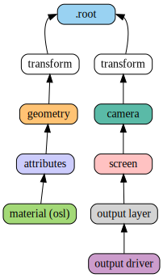
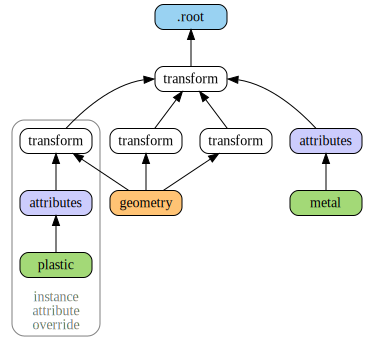
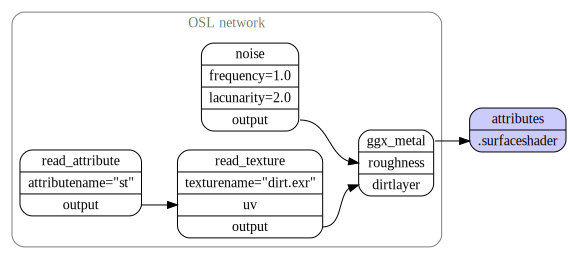
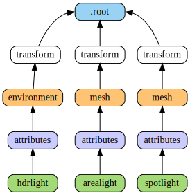
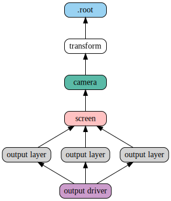
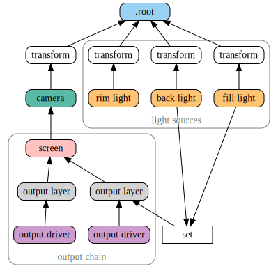

.. include:: definitions.rst

.. _chapter:guidelines:

Rendering Guidelines
====================

.. _section:basicscene:

Basic Scene Anatomy
-------------------



    The fundamental building blocks of an |nsi| scene

A minimal (and useful) |nsi| scene graph contains the three following
components:

#.  Geometry linked to the ``.root`` node, usually through a transform
    chain.

#.  |osl| materials linked to scene geometry through an
    :ref:`attributes<node:attributes>` node.

#.  At least one *outputdriver* |nsp| → |nsp| *outputlayer* |nsp| → |nsp|
    *screen* |nsp| → |nsp| *camera* |nsp| → |nsp| ``.root`` chain to
    describe a view and an output device.

The scene graph in shows a renderable scene with all the necessary
elements. Note how the connections always lead to the ``.root`` node.

In this view, a node with no output connections is not relevant by
definition and will be ignored.

.. Caution::
    For the scene to be visible, at least one of the materials has to be
    *emissive*.

.. _section:attributes:

.. index::
    .root node
    root node

A Word – or Two – About Attributes
----------------------------------

Those familiar with the *RenderMan* standard will remember the various
ways to attach information to elements of the scene (standard
attributes, user attributes, primitive variables, construction
parameters). E.g parameters passed to RenderMan Interface calls to
build certain objects. For example, knot vectors passed to
``RiNuPatch()``.


    Attribute inheritance and override

In |nsi| things are simpler and all attributes are set
through the ``NSISetAttribute()`` mechanism. The only distinction is
that some attributes are required (*intrinsic attributes*) and some are
optional: a :ref:`mesh node<node:mesh>` needs to have ``P`` and
``nvertices`` defined — otherwise the geometry is invalid.

.. Note::
    In this documentation, all intrinsic attributes are documented at
    the beginning of each section describing a particular node.

In |osl| shaders, attributes are accessed using the ``getattribute()``
function and *this is the only way to access attributes in |nsi|*.
Having one way to set and to access attributes makes things simpler (a
:ref:`design goal<chapter:background>`) and allows for extra
flexibility (another design goal). shows two features of attribute
assignment in |nsi|:

Attribute inheritance
   Attributes attached at some parent (in this case, a *metal*
   material) affect geometry downstream.

Attribute override
   It is possible to override attributes for a specific geometry by
   attaching them to a *transform* node directly upstream (the
   *plastic* material overrides *metal* upstream).

Note that any non-intrinsic attribute can be inherited and overridden,
including vertex attributes such as texture coordinates.

.. _section:instancing:

Instancing
----------

Instancing in |nsi| is naturally performed by connecting a geometry to
more than one transform (connecting a geometry node into a
``transform.objects`` attribute).



   Instancing in |nsi| with attribute inheritance and per-instance
   attribute override

The above figure shows a simple scene with a geometry instanced three
times. The scene also demonstrates how to override an attribute for one
particular geometry instance, an operation very similar to what we have
seen in :ref:`the attributes section<section:attributes>`. Note that
transforms can also be instanced and this allows for *instances of
instances* using the same semantics.

.. _section:creating_osl_networks:

Creating |osl| Networks
-----------------------



    A simple |osl| network connected to an attributes node

The semantics used to create |osl| networks are the same as for scene
creation. Each shader node in the network corresponds to a
|shader|_ node which must be created using |NSICreate|_.
Each shader node has implicit attributes corresponding to shader's
parameters and connection between said arguments is done using
|NSIConnect|_. Above diagran depicts a simple |osl| network connected
to an |attributes|_ node.

Some observations:

-   Both the source and destination attributes (passed to
    |NSIConnect|_ must be present and map to valid and compatible shader
    parameters (:ref:`Lines 21–23<osl_network_example>`).

   .. Note::
       There is an exception to this: any non-shader node can be
       connected to a string attribute of a shader node. This will
       result in the non-shader node's handle being used as the string's
       value.

       This behavior is useful when the shader needs to refer to another
       node, in a |osl| call to ``transform()`` or ``getattribute()``,
       for example.

-   There is no *symbolic linking* between shader arguments and geometry
    attributes (a.k.a. primvars). One has to explicitly use the
    ``getattribute()`` |osl| function to read attributes attached to
    geometry. In this is done in the ``read_attribute`` node (:ref:`Lines
    11–14<osl_network_example>`). Also see the section on
    :ref:`attributes<section:attributes>`.


.. _osl_network_example:

.. code-block:: shell
    :linenos:
    :emphasize-lines: 11-14, 21-23

    Create "ggx_metal" "shader"
    SetAttribute "ggx"
        "shaderfilename" "string" 1  ["ggx.oso"]

    Create "noise" "shader"
    SetAttribute "noise"
        "shaderfilename" "string" 1 ["simplenoise.oso"]
        "frequency" "float" 1 [1.0]
        "lacunarity" "float" 1 [2.0]

    Create "read_attribute" "shader"
    SetAttribute "read_attribute"
        "shaderfilename" "string" 1 ["read_attributes.oso"]
        "attributename" "string" 1 ["st"]

    Create "read_texture" "shader"
    SetAttribute "read_texture"
        "shaderfilename" "string" 1 ["read_texture.oso"]
        "texturename" "string" 1 ["dirt.exr"]

    Connect "read_attribute" "output" "read_texture" "uv"
    Connect "read_texture" "output" "ggx_metal" "dirtlayer"
    Connect "noise" "output" "ggx_metal" "roughness"

    # Connect the OSL network to an attribute node
    Connect "ggx_metal" "Ci" "attr" "surfaceshader"

.. _section:specifyinglights:

Lighting in the Nodal Scene Interface
-------------------------------------



   Creating lights in nsi

There are no special light source nodes in |nsi| (although the node,
which defines a sphere of infinite radius, could be considered a light
in practice).

Any scene geometry can become a light source if its surface shader
produces an ``emission()`` |closure|. Some operations on light sources,
such as *light linking*, are done using more :ref:`general
approaches<section:lightlinking>`.

Following is a quick summary on how to create different kinds of light
in |nsi|.

Area Lights
~~~~~~~~~~~

Area lights are created by attaching an emissive surface material to
geometry. Below is a simple |osl| shader for such lights (standard |osl|
emitter).

.. code-block:: c
   :caption: Example emitter for area lights
   :linenos:

   // Copyright (c) 2009-2010 Sony Pictures Imageworks Inc., et al.  All Rights Reserved.
   surface emitter     [[ string help = "Lambertian emitter material" ]]
   (
       float power = 1 [[ string help = "Total power of the light" ]],
       color Cs = 1    [[ string help = "Base color" ]])
   {
       // Because emission() expects a weight in radiance, we must convert by dividing
       // the power (in Watts) by the surface area and the factor of PI implied by
       // uniform emission over the hemisphere. N.B.: The total power is BEFORE Cs
       // filters the color!
       Ci = (power / (M_PI * surfacearea())) * Cs * emission();
   }

Spot and Point Lights
~~~~~~~~~~~~~~~~~~~~~

Such lights are created using an epsilon sized geometry (a small disk, a
particle, etc.) and optionally using extra arguments to the
``emission()`` |closure|.

.. code-block:: c
   :caption: An example OSL spot light shader
   :linenos:

   surface spotlight(
       color i_color = color(1),
       float intenstity = 1,
       float coneAngle = 40,
       float dropoff = 0,
       float penumbraAngle = 0
   ) {
       color result = i_color * intenstity * M_PI;

       // Cone and penumbra
       float cosangle = dot(-normalize(I), normalize(N));
       float coneangle = radians(coneAngle);
       float penumbraangle = radians(penumbraAngle);

       float coslimit = cos(coneangle / 2);
       float cospen = cos((coneangle / 2) + penumbraangle);
       float low = min(cospen, coslimit);
       float high = max(cospen, coslimit);

       result *= smoothstep(low, high, cosangle);

       if (dropoff > 0) {
           result *= clamp(pow(cosangle, 1 + dropoff),0,1);
       }
       Ci = result / surfacearea() * emission();
   }

Directional and HDR Lights
~~~~~~~~~~~~~~~~~~~~~~~~~~

Directional lights are created by using the node and setting the
``angle`` attribute to 0. HDR lights are also created using the
environment node, albeit with a 2π cone angle, and reading a
high dynamic range texture in the attached surface shader. Other
directional constructs, such as *solar lights*, can also be obtained
using the environment node.

Since the node defines a sphere of infinite radius any connected |osl|
shader must only rely on the ``I`` variable and disregard ``P``, as is
shown below.

.. code-block:: c
   :linenos:
   :caption: An example OSL shader to do HDR lighting

   shader hdrlight(
       string texturename = ""
   ) {
       vector wi = transform("world", I);

       float longitude = atan2(wi[0], wi[2]);
       float latitude = asin(wi[1]);

       float s = (longitude + M_PI) / M_2PI;
       float t = (latitude + M_PI_2) / M_PI;

       Ci = emission() * texture(texturename, s, t);
   }

.. Note::

   Environment geometry is visible to camera rays by default so
   it will appear as a background in renders. To disable this simply
   switch off camera visibility on the associated node.

.. _section:definingoutputdrivers:

Defining Output Drivers and Layers
----------------------------------



   |nsi| graph showing the image output chain


|nsi| allows for a very flexible image output model. All the following
operations are possible:

-  Defining many outputs in the same render (e.g. many EXR outputs)

-  Defining many output layers per output (e.g. multi-layer EXRs)

-  Rendering different scene views per output layer (e.g. one pass
   stereo render)

-  Rendering images of different resolutions from the same camera
   (e.g. two viewports using the same camera, in an animation software)

depicts a |nsi| scene to create one file with three layers. In this case,
all layers are saved to the same file and the render is using one view.
A more complex example is shown in : a left and right cameras are used
to drive two file outputs, each having two layers (``Ci`` and
``Diffuse`` colors).


   |nsi| graph for a stereo image output


.. _section:lightlayers:

Light Layers
------------



The ability to render a certain set of lights per output layer has a
formal workflow in |nsi|. One can use three methods to define the lights
used by a given output layer:

#. Connect the geometry defining lights directly to the
   ``outputlayer.lightset`` attribute

#. Create a set of lights using the ``set`` node and connect it into
   ``outputlayer.lightset``

#. A combination of both 1 and 2

Above diagram a scene using method to create an output layer containing
only illumination from two lights of the scene. Note that if there are
no lights or light sets connected to the ``lightset`` attribute then all
lights are rendered. The final output pixels contain the illumination
from the considered lights on the specific surface variable specified in
``outputlayer.variablename`` ().

.. _section:lightlinking:

Inter-Object Visibility
-----------------------

Some common rendering features are difficult to achieve using attributes
and hierarchical tree structures. One such example is inter-object
visibility in a 3D scene. A special case of this feature is *light
linking* which allows the artist to select which objects a particular
light illuminates, or not. Another classical example is a scene in which
a ghost character is invisible to camera rays but visible in a mirror.

In |nsi| such visibility relationships are implemented using
cross-hierarchy connection between one object and another. In the case
of the mirror scene, one would first tag the character invisible using
the attribute and then connect the attribute node of the receiving
object (mirror) to the visibility attribute of the source object (ghost)
to *override* its visibility status. Essentially, this "injects" a new
value for the ghost visibility for rays coming from the mirror.

.. figure:: image/vampire.svg
   :alt: Visibility override, both hierarchically and inter-object
   :name: fig:vampire
   :height: 7cm

   Visibility override, both hierarchically and inter-object

Above figure shows a scenario where both hierarchy attribute overrides
and inter-object visibility are applied:

-  The ghost transform has a visibility attribute set to 0 which makes
   the ghost invisible to all ray types

-  The hat of the ghost has its own attribute with a visibility set to 1
   which makes it visible to all ray types

-  The mirror object has its own attributes node that is used to
   override the visibility of the ghost as seen from the mirror. The nsi
   stream code to achieve that would look like this:

   .. code-block:: shell

       Connect "mirror_attribute" "" "ghost_attributes" "visibility"
           "value" "int" 1 [1]
           "priority" "int" 1 [2]

   Here, a priority of ``2`` has been set on the connection for
   documenting purposes, but it could have been omitted since
   connections always override regular attributes of equivalent
   priority.


.. rubric:: Footnotes

.. [1] Parameters passed to ```Ri`` calls to build certain objects.
    For example, knot vectors passed to ``RiNuPatch``.